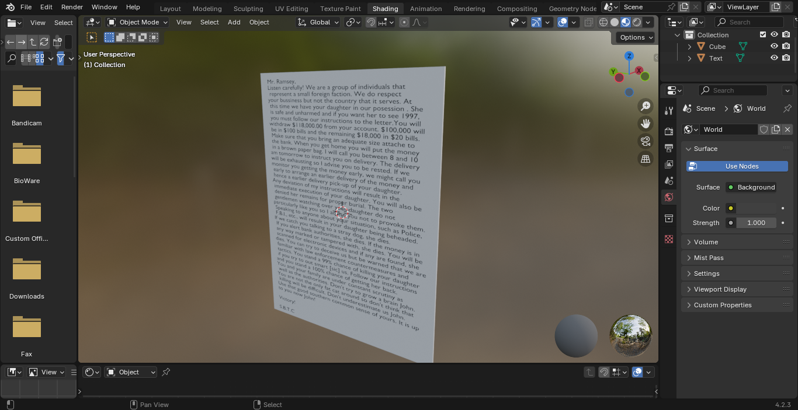
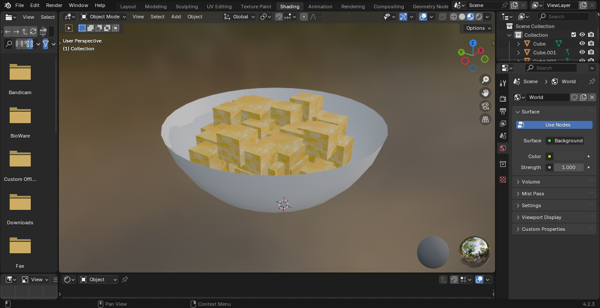
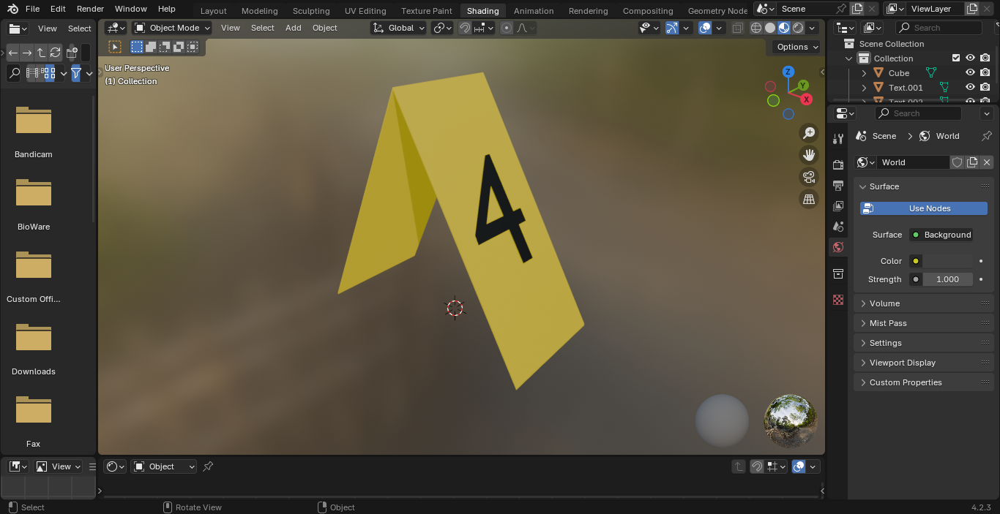
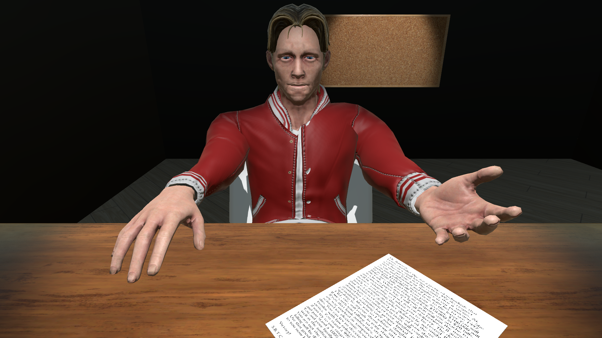
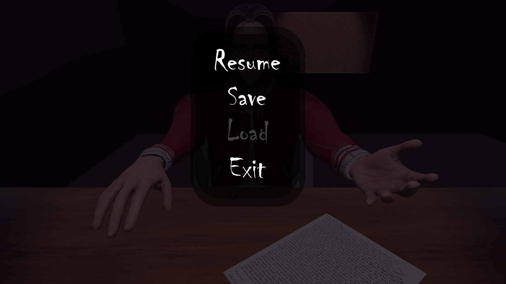

# Christmas Eve Murder

### Introduction to Mixed Realities project

> Butnaru Alexandru\
> Galațanu Emilia\
> Golache Denisa-Ioana

### @ FII UAIC 2024

# Week 7 Progress
## Assets downloaded:
[Corkboard](https://assetstore.unity.com/packages/3d/props/furniture/corkboard-desk-294674)\
[Christmas Decorations](https://assetstore.unity.com/packages/3d/props/interior/christmas-decoration-props-159202#description)\
[Furniture](https://assetstore.unity.com/packages/3d/props/furniture/big-furniture-pack-7717)\
[Man Character 80's](https://assetstore.unity.com/packages/3d/characters/humanoids/humans/man-character-80-s-273883)\
[Policeofficer | Characters | Unity Asset Store](https://assetstore.unity.com/packages/3d/characters/humanoids/humans/policeofficer-177761)\
[UMA 2](https://assetstore.unity.com/packages/3d/characters/uma-2-35611)\
[o3n Male and Female UMA Races | 3D Humanoids | Unity Asset Store](https://assetstore.unity.com/packages/3d/characters/humanoids/o3n-male-and-female-uma-races-102187)\
[Christmas Tree](https://www.cgtrader.com/items/721106/download-page)\
[Flashlight](https://assetstore.unity.com/packages/3d/props/electronics/flashlight-18972)\
[Fingerprints](https://www.fab.com/listings/901a4547-11f3-41a1-857c-0bed72691b93)
[Blood splatter decal package | 2D Textures & Materials | Unity Asset Store](https://assetstore.unity.com/packages/2d/textures-materials/blood-splatter-decal-package-7518#content)

## Modelling:
Ransom note:

Pineapple bowl:

Evidence marker:

## Scenes:
Detective's Office, during witness interrogation with evidence:

## UI:
In-Game Pause Menu:
